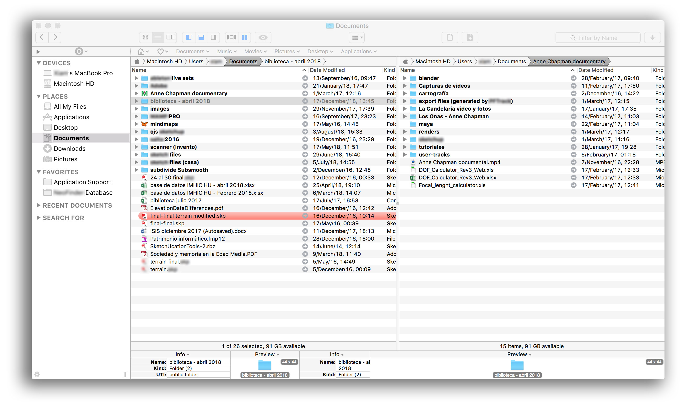

# Rationale

### Migration data (checklist)

* Good practices on migrate data between devices or hosts. A kind of "good practices" to automatise procedures and quick-actions
* This repository just hold our datums gathered, checklist _et alia_ and begin and end if fulfil our needs, priorities and standards. Anyway, *one caveat*: "There is no responsibility for data loss".

### What is this repository for?

* Quick summary
    - Checklist to migrate data between operating systems and/or between devices

### How do I get set up?

* Summary of set up
    - Check [Checklist.md](Checklist.md)
    - Check [Software.md](software.md)
* Configuration
    - Check [Colophon.md](Colophon.md)
* Deployment instructions
    - Once checked [Checklist.md](Checklist.md) deploy your strategy according your hardware, time, schedule, goals. Creativity and knowledge meets at this point to _solve_ this dilemma

### Who do I talk to? 

* Repo owner or admin
    - Contact `imhicihu` at `gmail` dot `com`

### Code of Conduct

* Please, check our [Code of Conduct](code_of_conduct.md)

### Legal

* All trademarks are the property of their respective owners.

### Licence

* The content of this project itself is licensed under the 